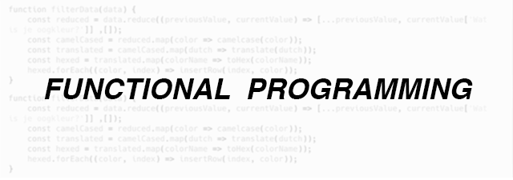

For the Information Design Datavisualization Course I had to fetch a dataset of a student questionnaire and clean this data using functions based on the Functional Programming paradigm.

In order to challenge myself and to make the cleaned data tangible I decided to visualize the data in the browser as well.

# Wiki
Check out the (Dutch) wiki for a comprehensive story about all the different aspects to this project!
