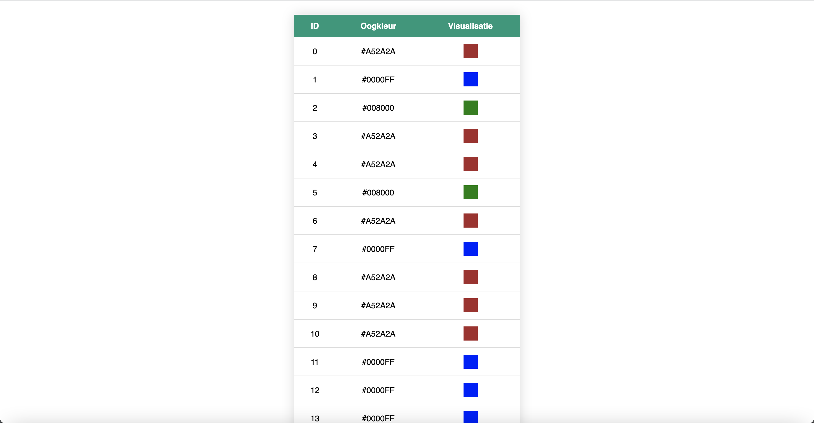
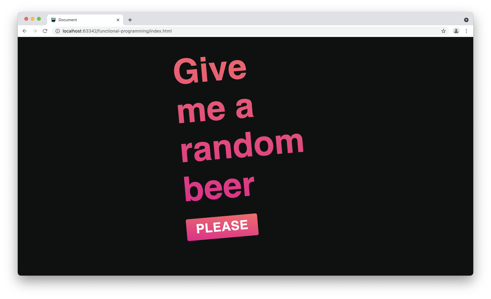
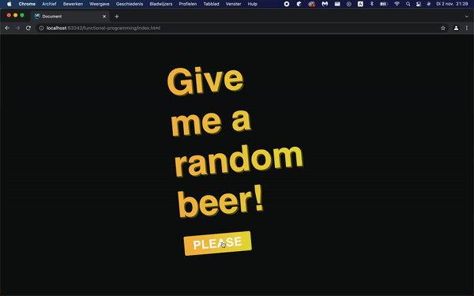

# Logbook

## Dag 1
Deze eerste dag had ik mij gruwelijk verslapen 
waardoor ik de volledige les fysiek gemist heb.

Dankzij een mailtje van Vincent Vijn en de slides
op GitHub heb ik alsnog alles kunnen doen wat nodig
was. Zoals het aanmaken van 3 repositories voor de 3
vakken; Het Teams kanaal joinen; een enquête invullen.

## Dag 2
Dag 2 was ik wel op tijd. Het begon met een presentatie 
van Robert met een korte recap van Blok Tech. Dit kwam van pas
aangezien ik zelf Blok Tech niet gevolgd had.

Ook was dit de dag om aan de opdracht te gaan werken. 
Op het begin vond ik de opdracht best onduidelijk. Maar
dit kreeg al snel meer vorm nadat Robert duidelijkheid had
verschaft.

Ik had er voor gekozen om alle oogkleuren in een tabel te
weergeven op hexadecimal en als een kleurblokje. 

Met fetch had ik al eerder gewerkt en dit was dan ook het
makkelijkste gedeelte van de code. Daarna zat ik met een 
array met objecten. En eigenlijk had ik geen idee hoe nu verder.

Wat ik wou doen - en waar ik best lang tegenaan liep - was 
1 antwoord uit de enquete halen. "Wat is je oogkleur?". 

Aangezien de vragen spaties betrefde en je dus niet met de
dot notering de property kon verkrijgen dacht ik alle keys 
om te zetten naar camelcase. Hiervoor bestond er een NPM package.

Maar hoe gebruik je die in godsnaam in de browser? Dat is waar ik
een oud project zocht. Ik heb namelijk eerder met Gulp gewerkt, 
een taskmanager. Ik dacht hiermee NPM packages te kunnen gebruiken.
Dat kon wel, maar dat had ik niet gedaan in dat project.

Dat is waar ik besefte een **bundler** nodig te hebben. Eureka!
Een bundler bundelt natuurlijk alle javascript, dus ook je NPM
packages, in 1 bestand. Dat is wat ik nodig had. En dus heb ik
Webpack gebruikt. Met Babel - die in staat stelt om NPM packages
en nieuwe ecmascript te kunnen gebruiken. 

Hierna kon ik de camelcase package gebruiken. Maar ik kwam 
erachter dat het eigenlijk helemaal niet nodig is. Je kunt 
namelijk keys met spaties ook benaderen door middel van `[]`. 
Dus:

```js
objectName["key name"];
```

Dit heb ik dan ook toegepast. Vervolgens bleek de camelcase 
package nog wel van pas te komen bij het camelcasen van de kleuren.

Voor dat ik de kleuren kon camelcasen en vertalen, was het 
noodzakelijk om een array te verkrijgen met alle oogkleuren. 
Hier had ik veel moeite mee. Maar uiteindelijk kwam ik uit 
op een Array Prototype Reduce higher-order function. 
Dit bleek de ideale oplossing. 

```js
const reduced = data.reduce((previousValue, currentValue) => [...previousValue, currentValue['Wat is je oogkleur?']] ,[]);
```

Met als uiteindelijke resultaat:



## Dag 3
In de morgen hebben we een korte introductie gekregen tot het 
documenteren van je project en het opstellen van een wiki. Ook 
hebben we heel kort gehad over Functional Programming. 
Programmeren waarbij alles een functie is zonder side-effects. 

Hierna ben ik begonnen met het documenteren van wat ik tot nu 
toe heb. Met als begin dit logboek. Vervolgens ben ik verder 
gegaan met de wiki.

## Dag 4
Op deze dag was ik ziek, dus qua groepje heb ik vrij weinig 
voor elkaar gekregen. Wel heb ik mij zelfstandig meer verdiept 
in Functional Programming. En mijn functies herschreven.

## Dag 5
Deze dag was ik ook ziek. Ik heb geprobeerd mij meer te verdiepen
in documentatie & de wiki. 

# Week 2
## Dag 6
Vandaag zijn we de dag begonnen met een presentatie over APIs. Daarna
zijn we onderzoek gaan doen naar beschikbaar API's. De duizenden API's
op het internet maakte het erg lastig voor me om een leuk, origineel
en bruikbare API te vinden.

Na een aantal ideeën ben ik uiteindelijk gegaan voor een bier API.
Hiervoor heb ik contact opgenomen met ratebeer.com. Helaas duurt dit
erg lang. Daarom ben ik voor nu gegaan voor punkapi.com. Deze bierlijst
is niet compleet en er ontbreken veel Nederlandse bieren.

Omdat ik later wil overstappen op een uitgebreidere API wil ik graag
de data "normalizen"? Weet niet zeker of dit het juiste woord is. Maar
uiteindelijk één object hebben met altijd dezelfde data. Zodat je 
de API kunt veranderen zonder veel aan je code te hoeven veranderen. 

Verder heb ik mij, veel te lang, bezig gehouden met Fetch gebruiken
in een Functional Programming paradigma. Uiteindelijk blijkt dat
promises gewoon niet lekker werkt met Functional Programming. Ik ga
mij dan ook minder vastbijten hierin en gewoon lekker code schrijven. 

## Dag 7
Vandaag hebben we een uitgebreide presentatie gehad over 
async en promises door Joost Faber. Ik vond de voorbeelden echt heel
goed en opmaak van de code ook. Dit wil ik gaan toepassen op mijn eigen
code. Zo heb ik nu gebruik gemaakt van Webpack voor het bundelen van
mijn code en het gebruiken van modules. Maar dit blijkt dus niet meer
nodig aangezien bijna alle browsers het native ondersteunen.

Na het verwijderen van webpack uit m'n project ben ik verder gegaan
met het opschonen van de data aan de hand van de Functional Programming
principles. Hiervoor heb ik de PH waarde van een biertje vertaald naar
"zuur" en "niet zuur". Zodat ik dit kan laten zien in een GUI. Ook
heb ik het jaar waarin het biertje voor het eerst is gebrouwen vertaald
naar een "x jaar geleden" string. Hiervoor heb ik 3 functies moeten
schrijven:
* Een functie die het jaartal uit een string kan filteren
* Een functie die een negatief getal naar een positief getal kan 
  omzetten
* Een functie die van een jaartal een "x jaar geleden" string kan 
  maken.
  
```js
const getYearOnly = date => typeof date === "string" ? date.match(/\b(19|20)\d{2}\b/) : date;
const toPositive = num => num < 0 ? num * -1 : num;
const yearToText = year => `${toPositive((parseInt(getYearOnly(year))) - new Date().getFullYear())} years ago`;
const phToName = ph => ph > 4.2 ? "not so sour" : "sour";
```

Aangezien je zonder plan niet echt code kan schrijven en het doelloos
voelt om gewoon zomaar data te gaan opschonen. Ben ik begonnen met wat
ik in m'n hoofd heb: een random beer "generator" (laat eigenlijk
een random biertje zien.) uit te werken in HTML en CSS. Zo simpel
mogelijk, maar wel een beetje mooi.

Dit is het eindresultaat vandaag:



Na de standup ben ik nog even doorgegaan. Waarbij 
ik bierkleuren heb opgezocht voor de gradient en een tip van Christiaan 
Zandbergen toegepast om de knop te laten ademen. Verder viel mij op dat 
het geheel niet lekker in het midden lag. Daarom heb ik dit nog eens 
herzien en alles in het midden geplaatst.

Ik wil niet teveel bezig zijn met het uiterlijk aangezien dit voor dit vak
niet van belang is. Maar het maakt het toch net even iets leuker.

Verder wil ik de "Give me a random beer" naar links laten schuiven zodra je 
op "please" klikt. En dat er dan aan de rechterkant een biertje verschijnt.
Hiervoor moet ik een state opslaan, maar een state is in de wortel al gewoon
een niet functioneel begrip. Tenzij je de state direct doorgeeft in de chain.



Aangezien het aanpassen van de DOM ook niet past in Functional Programming,
heb ik ervoor gekozen om de state op te slaan in een data attribute in de DOM.
Om zo states uit m'n javascript te houden en het zo "functional" mogelijk te 
houden:

```html
<header class="start-header" data-started="false"></header>
```

```js
const started = document.querySelector(".start-header").dataset.started // "false"
```

Ook heb ik alle functies voorzien van een korte beschrijving waarin ik evalueer hoe
de functie staat tegenover de Functional Programming principles:
```js
/**
 * Functional Function - Grabs the year from a string.
 * Definitely not fool proof. Years before 1600 and after 2099 are not "valid" according to this REGEX.
 * @param date
 * @returns {RegExpMatchArray|*}
 */
const getYearOnly = date => typeof date === "string" ? date.match(/\b(16|17|18|19|20)\d{2}\b/) : date;
```

Dit wil ik nog bereiken:
* De opgehaalde data laten zien in een redelijk vormgegeven element.
* Code opbreken in modules naar voorbeeld van Joost Faber.
* Wiki uitbreidden en aanpassen.
* Kijken of niet functional functies nog functional gemaakt kunnen worden.
